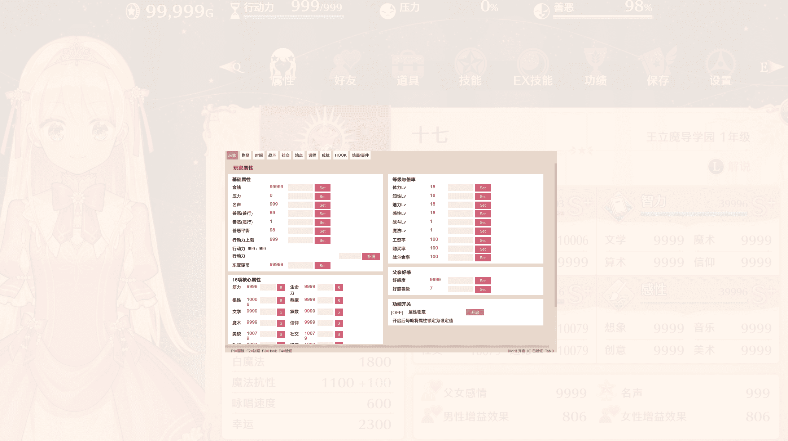
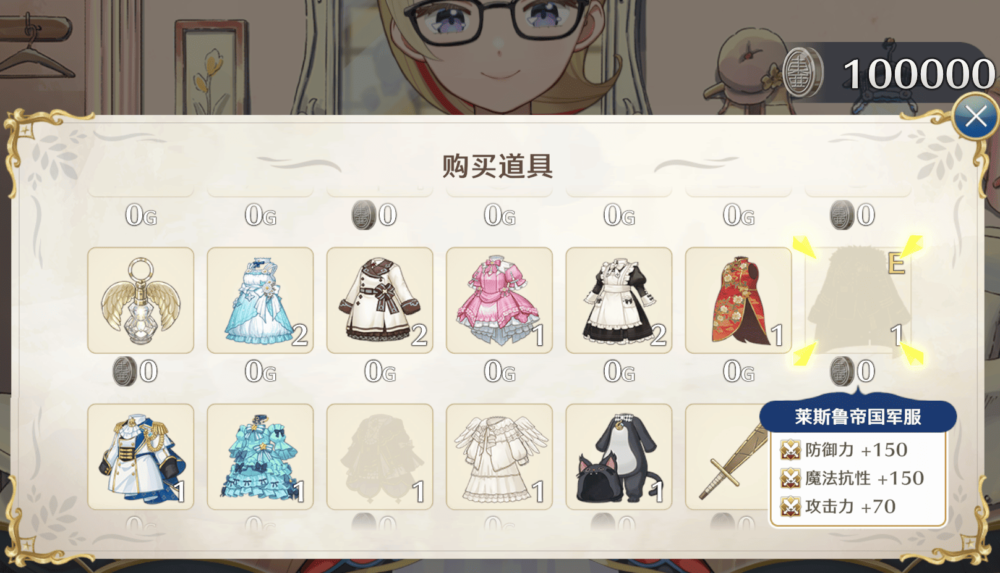
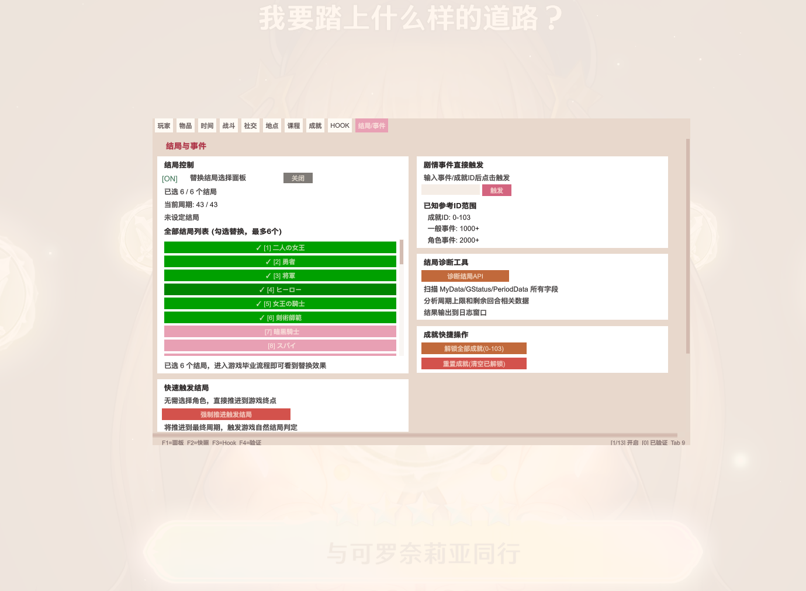

# 梦幻魔法公主 修改器 — Magical Princess Cheat Mod
Magical Princess MelonLoader Mod — 游戏内修改面板，按 F1 打开。




## 安装方法

### 1. 安装 MelonLoader

下载 MelonLoader.Installer：

- [MelonLoader.Installer 直接下载](https://github.com/LavaGang/MelonLoader/releases/latest/download/MelonLoader.Installer.exe)
- 或打开 [Release 页面](https://github.com/LavaGang/MelonLoader/releases) 自行选择版本

打开 MelonLoader.Installer，按以下步骤操作：

1. 在列表中找到 **Magical Princess**
2. Install v0.7.2（开发环境为 v0.7.2 Open-Beta）
3. 安装完成后，运行一次游戏，务必进入游戏主界面再退出（首次运行会生成必要文件）
4. 游戏根目录出现 `MelonLoader/` 和 `Mods/` 文件夹即安装成功

### 2. 安装 Mod

将 `MizuofCheatMod.dll` 放入游戏根目录的 `Mods/` 文件夹。

### 3. 启动

启动游戏，进入主界面后按下 **F1** 打开修改面板。

**Steam 游戏根目录快速定位：** Steam 库 → 右键 Magical Princess → 管理 → 浏览本地文件。

---

## 快捷键

| 按键 | 功能 |
|------|------|
| **F1** | 打开/关闭修改面板 |
| **F4** | 运行功能验证（检测 MyData 等运行状态） |
| **F5** | 立即获胜（战斗中） |

---

## 功能面板

面板共 **10 个标签页**，920x560 双栏布局，暖色柔和主题。

### 玩家（Tab 0）

| 功能 | 说明 |
|------|------|
| 金钱修改 | 输入数值点击 Set |
| 压力修改 | 输入数值点击 Set |
| 名声修改 | 输入数值点击 Set |
| 善恶值修改 | 善行/恶行/平衡值 独立编辑 |
| 东亚硬币修改 | 输入数值点击 Set |
| 行动力上限修改 | 可自定义上限值 |
| 行动力补满 | 一键补满至上限 |
| 16项核心属性编辑 | 筋力/生命力/根性/敏捷/文学/算数/魔术/信仰/美貌/社交/礼仪/道德/想像/创作/音感/美感 — 每项独立输入 Set |
| 一键 999 | 全属性设为 999 |
| 等级编辑 | 体力/知性/魅力/感性/战斗/魔法 Lv 可自定义 |
| 倍率编辑 | 工资率/购买率/战斗金率 可自定义 |
| 父亲好感编辑 | 好感度/好感等级 可自定义 |
| 属性锁定 | 每帧强制恢复金钱/压力/行动力满值 |

### 物品（Tab 1）

| 功能 | 说明 |
|------|------|
| 物品搜索 | 按名称搜索，支持中英文 |
| **分类筛选** | 全部/道具/衣服/武器防具/送礼用/重要物品 |
| 物品数量修改 | 每物品 +1/+10/x99 按钮 |
| **商店全物品** | 武器店/服装店上架全部物品，定价 0 元 |
| 商店免费 | 所有物品购买价格归零 |
| 最高售价 | 以 10 倍价格出售物品 |
| 批量 x99 | 全部物品数量设为 99 |
| 清除全部 | 全部物品数量归零 |

### 时间（Tab 2）

| 功能 | 说明 |
|------|------|
| 当前时间显示 | 期数/时刻/年份/月份 |
| 时刻切换 | 白天/夜晚/红月 |
| 时间跳转 | 输入期数直接跳转 |
| **时间冻结** | 阻止月末处理推进时间 |
| 执行月末处理 | 手动触发 CloseMonth |

### 战斗（Tab 3）

| 功能 | 说明 |
|------|------|
| 无敌模式 | 角色不会受到伤害 |
| 一击必杀 | 攻击即秒杀敌人 |
| **爱丽丝战斗力编辑** | HP/攻击力/防御力/速度/体力/黑魔法/白魔法/魔法抗性/咏唱速度/幸运/男性增益/女性增益 — 全可编辑 |
| 战斗属性一键 999 | 全战斗属性设为 999 |
| 立即胜利 | 战斗场景中一键获胜 |

### 社交（Tab 4）

| 功能 | 说明 |
|------|------|
| 角色选择 | 7 名可攻略角色网格选择 |
| 全员好感度 MAX | 一键全部拉满 |
| **好感度编辑** | 好感度/亲密度/恋爱等级 可自定义 |
| **社交次数编辑** | 对话次数/约会次数/送礼次数 可自定义 |
| 好感 MAX / 恋爱 MAX | 单角色一键拉满 |

### 地点（Tab 5）

| 功能 | 说明 |
|------|------|
| 当前位置显示 | 地点/时刻/父地点 |
| **快速传送** | 回家/中央广场/学园/郊外/面包店/食堂/武器店/服装店 |

### 课程（Tab 6）

| 功能 | 说明 |
|------|------|
| 课程状态显示 | 当前班级/课程次数 |
| **课程列表** | 显示所有课程状态（进行中/已完成） |
| **全部课程完成** | 一键完成所有课程 |
| 技能解锁 | 体力/知性/魅力/感性 技能一键解锁 |
| 全属性 +10 | 16 项属性各 +10（无 999 上限） |
| 课程次数设定 | 输入数值点击 Set |

### 成就（Tab 7）

| 功能 | 说明 |
|------|------|
| 成就进度显示 | 已解锁数 + 功绩点数 |
| **成就列表** | 滚动显示 0-103 号成就，已完成/未完成分色显示 |
| 单 ID 解锁 | 输入成就 ID 点击解锁 |
| 解锁全部 | 批量解锁 0-103 号成就 |
| 重置成就 | 清空已解锁列表 |

### HOOK（Tab 8）

| 功能 | 说明 |
|------|------|
| 运行时类型扫描 | 显示 Assembly-CSharp 所有类型 |
| 单例/Manager/数据类/枚举 | 分类展示 |
| 功能验证 | 检测所有游戏入口点可用性 |
| 搜索过滤 | 输入关键字过滤扫描结果 |

### 结局/事件（Tab 9）

| 功能 | 说明 |
|------|------|
| **结局触发** | 从游戏数据列出可选结局，选中后设定并调用触发 |
| 剧情事件触发 | 输入事件/成就 ID 触发 |
| 技能全点亮 | 一键解锁所有技能分支 |
| 成就批量操作 | 解锁全部/重置已解锁 |

---

## Harmony 补丁系统

Mod 使用 HarmonyLib 对游戏方法进行运行时注入，实现无法通过简单反射完成的修改：

| 补丁 | 目标方法 | 效果 |
|------|---------|------|
| CombatGod | `BattleCharacter.SetPhysicalDamage` / `SetMagicalDamage` | Prefix: 友方角色跳过伤害 |
| Combat1HK | `BattleCharacter.SetPhysicalDamage` / `SetMagicalDamage` | Prefix: 对敌人伤害放大至 99999 |
| FreeShop | `ItemData.get_priceBuy` | Postfix: 返回 0 |
| FreeShop | `ItemData.get_priceBuyBlackCoin` | Postfix: 黑币价格返回 0 |
| MaxSell | `ItemData.get_priceSellItem` | Postfix: 价格 ×10 |
| TimeFreeze | `MyData.CloseMonth` / `GameController.CloseMonth` | Prefix: 阻断月末处理 |

---

## 构建

```bash
dotnet build "MizuofCheatMod/MizuofCheatMod.csproj" -c Release
```

需要 .NET SDK + MelonLoader v0.7.2 依赖（位于 `../MelonLoader/` 和 `../Managed/`）。

---

## 项目结构

```
MizuofCheatMod/
├── Main.cs                  # 入口：快捷键 + 帧更新功能循环
├── MizuofCheatMod.csproj    # .NET Framework 4.8 项目
│
├── Harmony/
│   └── PatchController.cs   # Harmony 补丁（战斗/商店/时间冻结/商店全物品）
│
├── UI/                      # 面板 UI 层
│   ├── GUIStyleBuilder.cs   # 暖色配色 + 样式定义
│   ├── ModMenu.cs           # 面板引擎 + 组件 API
│   ├── Tab*.cs              # 10 个标签页（玩家/物品/时间/战斗/社交/地点/课程/成就/HOOK/结局事件）
│
├── Utils/                   # 工具层
│   ├── GameReflect.cs       # Dyn 反射包装器（int/float/string/方法调用）
│   ├── FeatureRegistry.cs   # 功能注册表
│   ├── GameHookScanner.cs   # 运行时类型扫描器
│   └── ModConfig.cs         # MelonPreferences 配置
│
└── Mods/                    # 编译输出
    └── MizuofCheatMod.dll
```

---

## 技术要点

- **反射包装器 Dyn：** 对游戏类型无任何直接引用，全部通过运行时反射访问字段/属性/方法
- **自动枚举转换：** `SetInt()` 检测目标字段类型是否为枚举，自动调用 `Enum.ToObject()` 转换
- **3 层 MyData 兜底：** Property Instance → Field Instance → FindFirstObjectByType，适应不同版本的 Unity 单例实现
- **浮点数支持：** 战斗属性字段为 `float` 类型，Dyn 提供 `F()` / `SF()` 方法专门处理
- **暖色面包主题：** 玫瑰粉/金色/薄荷配色方案，无分割线的卡片布局

---

## 作者

- **Mizuof**
- B站：https://space.bilibili.com/516995192/dynamic
- QQ群：624594852
- 网站：www.mizu7.top

本修改器完全免费，请勿用于商业用途。
